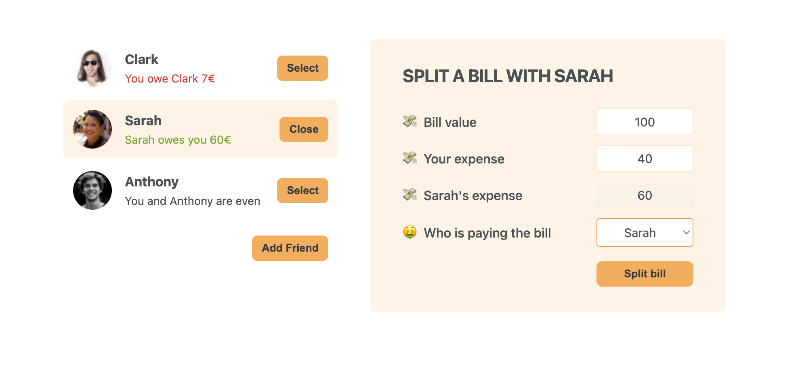

# React Eat-n-Split

It's a friend's expense tracker that helps users manage and track expenses among friends. 

## Features

- **Add a New Friend**: Add friends' details, including their name and image URL, to track new expenses.
- **Friends List**: View all friends along with their balance status. The list highlights debts and credits for easy understanding.
- **Select/Deselect Friends**: Choose a friend to split expenses or deselect to go back to the main view.
- **Split a Bill**: Input the bill's total amount, specify the amount you paid, and let the app calculate the rest. It adjusts balances based on who covered the bill.

## React Concepts Applied

### Components and Props

- Creating reusable components.
- Passing and accessing props in components.
- Structuring components hierarchically.

### State Management

- Using `useState` for local state management.
- Propagating state changes across components.
- Lifting state up for access by multiple components.

### Conditional Rendering

- Employing logical conditions to render UI elements.
- Manipulating components based on state.

### Forms and Events

- Handling forms and form submissions.
- Implementing controlled components.

### Lists and Keys

- Rendering lists dynamically.
- Understanding the purpose of keys in lists.

### Advanced Patterns

- Applying common patterns like lifting state up.
- Utilizing callback functions in components.
